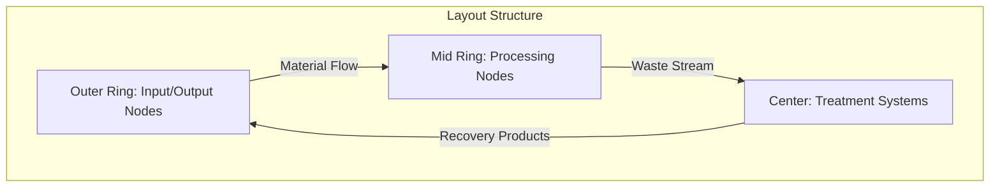

# Circular Sankey Diagram - Architecture & Design Plan

## Executive Summary

Transform the existing linear Sankey diagram into a circular layout that visually emphasizes the circular economy principles of the proposed biochar system. The design will showcase material flows, energy recovery, and closed-loop processes in an intuitive, animated visualization.

---

## 1. Design Philosophy

### Core Principles
1. **Visual Circularity** - Node arrangement emphasizes closed-loop material flows
2. **Process Flow Logic** - Clockwise progression follows material transformation stages
3. **Hierarchy Clarity** - Distinguish between primary processes and secondary loops
4. **Progressive Disclosure** - Reveal complexity through interaction
5. **Data Integrity** - Preserve all existing flow data and relationships

### Visual Metaphor
The circular layout represents:
- **Outer Circle**: Primary production cycle (chicken-house → processing → outputs)
- **Inner Connections**: Resource recovery and reuse loops
- **Center**: Energy and biochar production systems (pyrolysis, anaerobic digester)

---

## 2. Layout Architecture

### 2.1 Node Positioning Strategy

#### **Circular Layout Zones**



#### **Node Groups (Clockwise from 12 o'clock)**

**Zone 1: Inputs (12-3 o'clock)**
- Pine Shavings (0°)
- Chicken Feed (30°)
- Water/CO2 (60°)

**Zone 2: Primary Production (3-6 o'clock)**
- Chicken House (90°)
- Live Birds flow indicator (120°)
- Processing Plant (150°)

**Zone 3: Products (6-9 o'clock)**
- Chicken Meat (180°)
- FOG (Fats/Oils/Greases) (210°)
- Output products (240°)

**Zone 4: Treatment & Recovery (9-12 o'clock)**
- Pyrolysis Unit (270°)
- Anaerobic Digester (300°)
- Farm/Waterways (330°)

#### **Mathematical Positioning**

```typescript
interface CircularLayoutConfig {
  centerX: number;
  centerY: number;
  radiusOuter: number;    // 280px - inputs/outputs
  radiusMid: number;      // 200px - processing nodes
  radiusInner: number;    // 120px - treatment systems
  angleOffset: number;    // -90° to start at top
}

function calculateNodePosition(
  angle: number,
  radius: number,
  config: CircularLayoutConfig
): {x: number, y: number} {
  const radians = (angle + config.angleOffset) * (Math.PI / 180);
  return {
    x: config.centerX + radius * Math.cos(radians),
    y: config.centerY + radius * Math.sin(radians)
  };
}
```

### 2.2 Node Classification System

```typescript
enum NodeType {
  INPUT = 'input',           // External inputs
  COMPONENT = 'component',   // Processing units
  TREATMENT = 'treatment',   // Pyrolysis/AD
  OUTPUT = 'output',         // Final products
  RECOVERY = 'recovery'      // Recycled materials
}

interface CircularSankeyNode extends SankeyNode {
  nodeType: NodeType;
  angle: number;           // Position on circle (degrees)
  radius: number;          // Distance from center
  layer: number;           // Visual depth (0=front, 1=mid, 2=back)
  isCircularFlow?: boolean; // Part of closed loop?
}
```

---

## 3. Path Generation System

### 3.1 Path Types

#### **Type 1: Forward Flow Paths**
- Linear progression along the circle
- Standard Bezier curves
- Used for: inputs → chicken-house → processing → outputs

```typescript
function createForwardPath(
  source: CircularSankeyNode,
  target: CircularSankeyNode
): string {
  // Standard cubic Bezier with control points outside circle
  const controlDistance = 50; // px beyond node radius
  return `M ${source.x},${source.y} 
          C ${source.x + controlDistance},${source.y} 
            ${target.x - controlDistance},${target.y} 
            ${target.x},${target.y}`;
}
```

#### **Type 2: Circular Return Paths**
- Arc paths that curve back to earlier stages
- Visually distinct (dashed or lighter opacity)
- Used for: biochar → chicken-house, digestate → farm

```typescript
function createCircularReturnPath(
  source: CircularSankeyNode,
  target: CircularSankeyNode,
  clockwise: boolean = true
): string {
  // Arc path along or inside the circular boundary
  const arcRadius = (source.radius + target.radius) / 2 - 40;
  const largeArc = Math.abs(target.angle - source.angle) > 180 ? 1 : 0;
  const sweep = clockwise ? 1 : 0;
  
  return `M ${source.x},${source.y}
          A ${arcRadius},${arcRadius} 0 ${largeArc},${sweep}
            ${target.x},${target.y}`;
}
```

#### **Type 3: Cross-Circle Paths**
- Direct paths across the circle interior
- Used for: treatment systems ↔ processing nodes
- Visual layering to minimize crossing

```typescript
function createCrossPaths(
  source: CircularSankeyNode,
  target: CircularSankeyNode
): string {
  // Straight or gently curved path through center
  const midX = (source.x + target.x) / 2;
  const midY = (source.y + target.y) / 2;
  
  // Pull toward center slightly for visual interest
  const centerPull = 0.8;
  const controlX = midX * centerPull + config.centerX * (1 - centerPull);
  const controlY = midY * centerPull + config.centerY * (1 - centerPull);
  
  return `M ${source.x},${source.y}
          Q ${controlX},${controlY}
            ${target.x},${target.y}`;
}
```

### 3.2 Path Styling Strategy

```typescript
interface PathStyle {
  flowType: 'material' | 'energy' | 'biochar' | 'gas' | 'manure';
  isCircular: boolean;
  strokeWidth: number;     // Based on flow value
  opacity: number;         // 0.6 for circular, 0.8 for forward
  strokeDasharray?: string; // "8,4" for circular flows
  animationSpeed: number;  // Particles per second
}

const PATH_STYLE_MAP: Record<string, Partial<PathStyle>> = {
  biochar: {
    strokeDasharray: '8,4',
    opacity: 0.7,
    animationSpeed: 0.5
  },
  energy: {
    opacity: 0.9,
    animationSpeed: 1.2
  },
  manure: {
    opacity: 0.8,
    animationSpeed: 0.8
  }
};
```

---

## 4. Visual Hierarchy & Styling

### 4.1 Color System

#### **Material Type Colors**
```typescript
const CIRCULAR_COLOR_PALETTE = {
  // Core materials
  manure: '#92400E',      // Brown - organic waste
  biochar: '#065F46',     // Dark green - carbon sink
  digestate: '#059669',   // Green - nutrients
  
  // Energy flows
  syngas: '#F59E0B',      // Amber - heat/energy
  methane: '#8B5CF6',     // Purple - bio-methane
  
  // Products
  meat: '#10B981',        // Green - final product
  fertilizer: '#34D399',  // Light green - soil amendment
  
  // Inputs
  feed: '#FFA500',        // Orange
  pine: '#8B7355',        // Tan/brown
  
  // Highlights
  circularFlow: '#6366F1', // Indigo - emphasize loops
  linearFlow: '#6B7280'    // Gray - standard flow
};
```

#### **Visual Emphasis**
- **Circular flows**: Brighter colors, subtle glow effect
- **High-volume flows**: Thicker paths (scale with flow value)
- **Energy flows**: Animated particles moving along path
- **Critical loops**: Highlight on hover with connected path illumination

### 4.2 Node Styling

```typescript
interface NodeVisualConfig {
  size: number;           // Base: 50px diameter
  borderWidth: number;    // 2-4px based on importance
  glowRadius: number;     // 0-10px for emphasis
  iconSize: number;       // 30px
  labelPosition: 'inside' | 'outside' | 'curved';
}

const NODE_STYLES = {
  input: {
    shape: 'rounded-rect',
    size: 45,
    borderWidth: 2
  },
  component: {
    shape: 'rounded-rect',
    size: 60,
    borderWidth: 3,
    glowRadius: 5
  },
  treatment: {
    shape: 'circle',
    size: 70,
    borderWidth: 4,
    glowRadius: 8
  }
};
```

---

## 5. Animation System

### 5.1 Transition Animations

```typescript
interface AnimationConfig {
  duration: number;        // ms
  easing: string;         // d3.easing function
  stagger: number;        // ms delay between elements
}

const ANIMATIONS = {
  nodeEnter: {
    duration: 800,
    easing: 'easeCubicOut',
    effects: ['scale', 'opacity', 'position']
  },
  pathDraw: {
    duration: 1000,
    easing: 'easeQuadInOut',
    stagger: 100
  },
  systemSwitch: {
    duration: 1200,
    easing: 'easeCubicInOut',
    nodeDelay: 50,
    pathDelay: 25
  }
};
```

### 5.2 Flow Animations

```typescript
interface FlowParticle {
  path: SVGPathElement;
  speed: number;          // 0.0-1.0 of path per second
  size: number;          // 3-8px
  color: string;
  opacity: number;
}

function animateFlowParticles(
  link: SankeyLink,
  pathElement: SVGPathElement
): void {
  // Create particle group
  const particles = createParticles(link.value / 100); // Scale to flow
  
  particles.forEach((particle, i) => {
    const delay = (i / particles.length) * 2000; // Stagger
    animateParticleAlongPath(particle, pathElement, delay);
  });
}

### 5.3 Enhanced Flow Particle System (Moving Dots)

Based on D3.js Sankey implementations with animated flow indicators, the circular Sankey will feature moving particles that travel along the flow paths to visualize material movement dynamically.

#### **Particle Visual Design**

```typescript
interface FlowParticle {
  // Visual properties
  shape: 'circle' | 'square' | 'custom';
  size: number;              // 4-10px based on flow importance
  color: string;             // Match flow type
  opacity: number;           // 0.6-0.9
  blur?: number;             // Optional glow effect
  
  // Animation properties
  speed: number;             // pixels per second
  pathOffset: number;        // 0.0-1.0 starting position
  delay: number;             // ms before starting
  
  // Behavior
  persistent: boolean;       // Loops continuously
  fadeInOut: boolean;       // Fade at start/end of path
}

const PARTICLE_CONFIGS: Record<string, Partial<FlowParticle>> = {
  highVolume: {
    size: 8,
    speed: 100,
    opacity: 0.8,
    particleCount: 12        // More particles for major flows
  },
  mediumVolume: {
    size: 6,
    speed: 80,
    opacity: 0.7,
    particleCount: 6
  },
  lowVolume: {
    size: 4,
    speed: 60,
    opacity: 0.6,
    particleCount: 3
  },
  circularFlow: {
    size: 7,
    speed: 70,
    opacity: 0.85,
    blur: 2,                 // Glowing effect for emphasis
    particleCount: 8
  }
};
```

#### **Particle Movement Implementation**

```typescript
class FlowParticleAnimator {
  private particles: Map<string, FlowParticle[]> = new Map();
  private animationFrameId?: number;
  
  /**
   * Initialize particles on all flow paths
   */
  initializeParticles(links: SankeyLink[], pathElements: Map<string, SVGPathElement>): void {
    links.forEach(link => {
      const pathElement = pathElements.get(link.id);
      if (!pathElement) return;
      
      const config = this.getParticleConfig(link);
      const particles = this.createParticlesForPath(link, pathElement, config);
      
      this.particles.set(link.id, particles);
    });
    
    this.startAnimation();
  }
  
  /**
   * Create particles for a specific path
   */
  private createParticlesForPath(
    link: SankeyLink,
    pathElement: SVGPathElement,
    config: Partial<FlowParticle>
  ): FlowParticle[] {
    const particleCount = config.particleCount || 5;
    const particles: FlowParticle[] = [];
    const pathLength = pathElement.getTotalLength();
    
    // Evenly distribute particles along path
    for (let i = 0; i < particleCount; i++) {
      const particle: FlowParticle = {
        shape: 'circle',
        size: config.size || 6,
        color: link.color,
        opacity: config.opacity || 0.7,
        blur: config.blur,
        speed: config.speed || 80,
        pathOffset: i / particleCount,  // Spread evenly
        delay: (i / particleCount) * 2000,  // Stagger start
        persistent: true,
        fadeInOut: true
      };
      
      particles.push(particle);
    }
    
    return particles;
  }
  
  /**
   * Animate all particles using requestAnimationFrame
   */
  private startAnimation(): void {
    let lastTime = performance.now();
    
    const animate = (currentTime: number) => {
      const deltaTime = currentTime - lastTime;
      lastTime = currentTime;
      
      // Update each particle's position
      this.particles.forEach((particles, linkId) => {
        particles.forEach(particle => {
          this.updateParticlePosition(particle, deltaTime);
          this.renderParticle(particle, linkId);
        });
      });
      
      this.animationFrameId = requestAnimationFrame(animate);
    };
    
    this.animationFrameId = requestAnimationFrame(animate);
  }
  
  /**
   * Update particle position along path
   */
  private updateParticlePosition(particle: FlowParticle, deltaTime: number): void {
    const pathElement = this.getPathElement(particle);
    const pathLength = pathElement.getTotalLength();
    
    // Calculate movement
    const distance = (particle.speed * deltaTime) / 1000; // px per frame
    const offsetIncrement = distance / pathLength;
    
    // Update offset (loop when reaching end)
    particle.pathOffset += offsetIncrement;
    if (particle.pathOffset > 1.0) {
      particle.pathOffset = 0.0;
    }
  }
  
  /**
   * Render particle at current position
   */
  private renderParticle(particle: FlowParticle, linkId: string): void {
    const pathElement = this.getPathElement(linkId);
    const pathLength = pathElement.getTotalLength();
    const point = pathElement.getPointAtLength(particle.pathOffset * pathLength);
    
    // Get or create particle SVG element
    let particleElement = this.getParticleElement(particle, linkId);
    
    // Update position
    particleElement.setAttribute('cx', point.x.toString());
    particleElement.setAttribute('cy', point.y.toString());
    
    // Apply fade in/out at path ends
    if (particle.fadeInOut) {
      const fadeDistance = 0.1; // Fade in first/last 10%
      let opacity = particle.opacity;
      
      if (particle.pathOffset < fadeDistance) {
        opacity *= particle.pathOffset / fadeDistance;
      } else if (particle.pathOffset > (1.0 - fadeDistance)) {
        opacity *= (1.0 - particle.pathOffset) / fadeDistance;
      }
      
      particleElement.setAttribute('opacity', opacity.toString());
    }
    
    // Apply glow effect if specified
    if (particle.blur) {
      particleElement.setAttribute('filter', `blur(${particle.blur}px)`);
    }
  }
  
  /**
   * Stop all animations
   */
  stopAnimation(): void {
    if (this.animationFrameId) {
      cancelAnimationFrame(this.animationFrameId);
      this.animationFrameId = undefined;
    }
  }
  
  /**
   * Adjust animation speed (e.g., for debugging or user preference)
   */
  setSpeedMultiplier(multiplier: number): void {
    this.particles.forEach(particles => {
      particles.forEach(particle => {
        particle.speed *= multiplier;
      });
    });
  }
}
```

#### **SVG Particle Rendering**

```typescript
/**
 * Create SVG elements for particles
 */
function createParticleSVGElements(
  svg: SVGElement,
  particles: FlowParticle[],
  linkId: string
): void {
  const particleGroup = svg.append('g')
    .attr('class', `flow-particles-${linkId}`)
    .attr('pointer-events', 'none'); // Don't interfere with interactions
  
  particles.forEach((particle, index) => {
    const circle = particleGroup.append('circle')
      .attr('class', `particle particle-${index}`)
      .attr('r', particle.size / 2)
      .attr('fill', particle.color)
      .attr('opacity', particle.opacity)
      .style('mix-blend-mode', 'screen'); // Additive blending for glow
    
    // Add glow effect with filter
    if (particle.blur) {
      const filterId = `glow-${linkId}-${index}`;
      const defs = svg.select('defs');
      
      const filter = defs.append('filter')
        .attr('id', filterId)
        .attr('x', '-50%')
        .attr('y', '-50%')
        .attr('width', '200%')
        .attr('height', '200%');
      
      filter.append('feGaussianBlur')
        .attr('in', 'SourceGraphic')
        .attr('stdDeviation', particle.blur);
      
      circle.attr('filter', `url(#${filterId})`);
    }
  });
}
```

#### **Particle Behavior by Flow Type**

```typescript
/**
 * Customize particle behavior based on material/energy type
 */
function getParticleConfigForFlowType(type: string): Partial<FlowParticle> {
  switch (type) {
    case 'biochar':
      return {
        shape: 'circle',
        size: 6,
        color: '#065F46',
        opacity: 0.85,
        speed: 60,        // Slower for solid material
        blur: 2,          // Slight glow
        particleCount: 8
      };
      
    case 'energy':
    case 'syngas':
      return {
        shape: 'circle',
        size: 5,
        color: '#F59E0B',
        opacity: 0.9,
        speed: 120,       // Faster for energy
        blur: 3,          // More glow for energy
        particleCount: 15
      };
      
    case 'manure':
    case 'material':
      return {
        shape: 'circle',
        size: 7,
        color: '#92400E',
        opacity: 0.75,
        speed: 80,
        particleCount: 10
      };
      
    case 'gas':
    case 'methane':
      return {
        shape: 'circle',
        size: 4,
        color: '#8B5CF6',
        opacity: 0.8,
        speed: 100,
        blur: 2,
        particleCount: 12
      };
      
    default:
      return {
        shape: 'circle',
        size: 6,
        color: '#6B7280',
        opacity: 0.7,
        speed: 80,
        particleCount: 6
      };
  }
}
```

#### **Performance Optimization**

```typescript
/**
 * Optimize particle animations for performance
 */
class ParticleOptimizer {
  private maxParticles = 200;        // Global limit
  private visibilityThreshold = 0.3;  // Min opacity to render
  private useCanvas = false;          // Switch to canvas if needed
  
  /**
   * Adjust particle count based on performance
   */
  optimizeParticleCount(fps: number): void {
    if (fps < 30) {
      // Reduce particle count by 50%
      this.reduceParticles(0.5);
    } else if (fps < 45) {
      // Reduce by 25%
      this.reduceParticles(0.75);
    }
    // If FPS > 55, gradually increase back to normal
    else if (fps > 55) {
      this.increaseParticles(1.1);
    }
  }
  
  /**
   * Cull particles that are barely visible
   */
  cullInvisibleParticles(): void {
    this.particles.forEach((particles, linkId) => {
      const visible = particles.filter(p => 
        p.opacity > this.visibilityThreshold
      );
      this.particles.set(linkId, visible);
    });
  }
  
  /**
   * Switch to canvas rendering for better performance
   */
  switchToCanvas(): void {
    this.useCanvas = true;
    // Re-render particles using canvas instead of SVG
    this.renderParticlesOnCanvas();
  }
}
```

#### **Interactive Particle Effects**

```typescript
/**
 * Particle behavior during user interaction
 */
interface ParticleInteractionEffects {
  onHover: (linkId: string) => void;
  onClick: (linkId: string) => void;
  onFilter: (activeFlows: Set<string>) => void;
}

const particleInteractions: ParticleInteractionEffects = {
  /**
   * Emphasize particles on hovered flow
   */
  onHover: (linkId: string) => {
    const particles = particleAnimator.getParticles(linkId);
    particles.forEach(p => {
      p.size *= 1.5;
      p.opacity = Math.min(1.0, p.opacity * 1.3);
      p.speed *= 1.5;  // Faster on hover
      p.blur = (p.blur || 0) + 2;
    });
  },
  
  /**
   * Pulse effect on click
   */
  onClick: (linkId: string) => {
    const particles = particleAnimator.getParticles(linkId);
    particles.forEach((p, i) => {
      // Create burst effect
      setTimeout(() => {
        p.size *= 2;
        setTimeout(() => p.size /= 2, 200);
      }, i * 50);
    });
  },
  
  /**
   * Show only filtered flow particles
   */
  onFilter: (activeFlows: Set<string>) => {
    particleAnimator.getAllParticles().forEach((particles, linkId) => {
      const isActive = activeFlows.has(linkId);
      particles.forEach(p => {
        p.opacity = isActive ? p.opacity : 0.1;
        p.speed = isActive ? p.speed : p.speed * 0.3;
      });
    });
  }
};
```

#### **Visual Examples**

The moving particles will create visual effects similar to the D3.js Sankey you showed:
- **Dotted flow lines**: Regular circles moving along paths
- **Speed variation**: Faster for energy, slower for solid materials
- **Density variation**: More particles for high-volume flows
- **Color matching**: Particles match the flow color
- **Smooth loops**: Particles seamlessly loop for circular flows (biochar → chicken-house)
- **Fade effects**: Gentle fade in/out at path endpoints

```

---

## 6. Interaction Design

### 6.1 Hover Behaviors

```typescript
interface HoverState {
  hoveredNode?: CircularSankeyNode;
  hoveredPath?: SankeyLink;
  connectedNodes: Set<string>;
  connectedPaths: Set<string>;
}

function onNodeHover(node: CircularSankeyNode): void {
  // 1. Highlight node
  node.glowRadius = 12;
  node.scale = 1.1;
  
  // 2. Brighten connected paths
  const connectedPaths = getConnectedPaths(node);
  connectedPaths.forEach(path => {
    path.opacity = 1.0;
    path.strokeWidth *= 1.2;
  });
  
  // 3. Dim unconnected elements
  const otherElements = getUnconnectedElements(node);
  otherElements.forEach(el => el.opacity = 0.2);
  
  // 4. Show tooltip
  showTooltip(node, {
    position: getTooltipPosition(node),
    content: generateNodeTooltip(node)
  });
}
```

### 6.2 Click Interactions

```typescript
function onNodeClick(node: CircularSankeyNode): void {
  // Show detailed panel
  showDetailPanel({
    component: node.id,
    flows: getNodeFlows(node),
    metrics: getNodeMetrics(node),
    position: 'side-panel'
  });
  
  // Highlight complete flow path
  highlightFlowChain(node);
}
```

### 6.3 Filter & Focus Mode

```typescript
enum FilterMode {
  ALL = 'all',
  CIRCULAR_ONLY = 'circular',
  ENERGY = 'energy',
  MATERIALS = 'materials',
  BY_COMPONENT = 'component'
}

function applyFilter(mode: FilterMode, value?: string): void {
  const visibleNodes = getFilteredNodes(mode, value);
  const visiblePaths = getFilteredPaths(mode, value);
  
  // Animate to filtered state
  transitionToFilteredView(visibleNodes, visiblePaths);
}
```

---

## 7. Data Integration

### 7.1 Data Transformation

```typescript
interface FlowDataTransformer {
  // Convert flows.json to circular layout
  transformFlowsToCircular(
    flows: Flow[],
    systemView: 'current' | 'proposed'
  ): {
    nodes: CircularSankeyNode[],
    links: SankeyLink[]
  };
  
  // Calculate node positions
  calculateNodeLayout(
    nodes: CircularSankeyNode[],
    config: CircularLayoutConfig
  ): Map<string, {x: number, y: number}>;
  
  // Identify circular flows
  detectCircularFlows(links: SankeyLink[]): Set<string>;
}
```

### 7.2 Dynamic Flow Values

```typescript
interface FlowCalculator {
  // Estimate flow quantities based on material type
  calculateFlowValue(material: string, systemView: string): number;
  
  // Proportional split for branches
  splitFlow(
    totalFlow: number,
    branches: {target: string, percentage: number}[]
  ): Map<string, number>;
  
  // Mass balance validation
  validateMassBalance(nodes: CircularSankeyNode[]): boolean;
}
```

---

## 8. Component Structure

### 8.1 New Component: CircularSankeyDiagram

```typescript
// components/d3/CircularSankeyDiagram.tsx
export function CircularSankeyDiagram({
  systemView,
  showAnimations = true,
  enableInteractions = true,
  filterMode = 'all'
}: CircularSankeyProps) {
  // State management
  const [hoveredNode, setHoveredNode] = useState<string | null>(null);
  const [selectedNode, setSelectedNode] = useState<string | null>(null);
  const [layoutConfig] = useState<CircularLayoutConfig>({...});
  
  // Data transformation
  const circularData = useCircularLayoutData(systemView);
  
  // D3 rendering
  useEffect(() => {
    renderCircularDiagram(svgRef.current, circularData, layoutConfig);
  }, [circularData, layoutConfig]);
  
  return (
    <div className="circular-sankey-container">
      <svg ref={svgRef} />
      {hoveredNode && <Tooltip node={hoveredNode} />}
      {selectedNode && <DetailPanel node={selectedNode} />}
    </div>
  );
}
```

### 8.2 Supporting Utilities

```typescript
// lib/circularSankeyLayout.ts
export class CircularSankeyLayout {
  constructor(config: CircularLayoutConfig) {...}
  
  positionNodes(nodes: CircularSankeyNode[]): Map<string, Position>;
  generatePaths(links: SankeyLink[]): Map<string, PathData>;
  calculateIntersections(paths: PathData[]): IntersectionMap;
  optimizeLayout(nodes: CircularSankeyNode[]): CircularSankeyNode[];
}

// lib/circularFlowAnimations.ts
export class FlowAnimationEngine {
  startFlowAnimations(paths: SVGPathElement[]): void;
  stopFlowAnimations(): void;
  updateAnimationSpeed(speedMultiplier: number): void;
}
```

---

## 9. Performance Optimization

### 9.1 Rendering Strategy

```typescript
const OPTIMIZATION_CONFIG = {
  // Use canvas for complex animations
  useCanvas: true,
  canvasLayering: {
    static: true,      // Background, static nodes
    dynamic: true,     // Animated flows, hover effects
    interactive: true  // Tooltips, overlays
  },
  
  // Throttle/debounce settings
  hoverDebounce: 50,      // ms
  resizeThrottle: 100,    // ms
  animationFrame: true,   // Use requestAnimationFrame
  
  // Lazy loading
  loadThreshold: 1000,    // Only load when in viewport
  unloadOffscreen: true
};
```

### 9.2 Path Optimization

```typescript
// Simplify paths when performance drops
function simplifyPath(
  path: string,
  tolerance: number = 1.0
): string {
  // Use Douglas-Peucker algorithm
  return simplifyPathString(path, tolerance);
}

// Level of detail based on zoom/viewport
function getPathLOD(
  path: SankeyLink,
  viewportScale: number
): 'high' | 'medium' | 'low' {
  if (viewportScale > 1.5) return 'high';
  if (viewportScale > 0.8) return 'medium';
  return 'low';
}
```

---

## 10. Responsive Design

### 10.1 Breakpoints

```typescript
const RESPONSIVE_CONFIGS: Record<string, CircularLayoutConfig> = {
  mobile: {
    centerX: 180,
    centerY: 180,
    radiusOuter: 140,
    radiusMid: 100,
    radiusInner: 60,
    fontSize: 10,
    nodeSize: 40
  },
  tablet: {
    centerX: 300,
    centerY: 300,
    radiusOuter: 220,
    radiusMid: 160,
    radiusInner: 100,
    fontSize: 11,
    nodeSize: 50
  },
  desktop: {
    centerX: 450,
    centerY: 450,
    radiusOuter: 280,
    radiusMid: 200,
    radiusInner: 120,
    fontSize: 12,
    nodeSize: 60
  }
};
```

### 10.2 Touch Interactions

```typescript
interface TouchGestures {
  tap: (node: CircularSankeyNode) => void;
  doubleTap: (node: CircularSankeyNode) => void;
  longPress: (node: CircularSankeyNode) => void;
  pinchZoom: (scale: number) => void;
  pan: (dx: number, dy: number) => void;
}
```

---

## 11. Accessibility

### 11.1 ARIA Attributes

```typescript
function addAccessibilityAttributes(
  node: SVGElement,
  data: CircularSankeyNode
): void {
  node.setAttribute('role', 'img');
  node.setAttribute('aria-label', generateAriaLabel(data));
  node.setAttribute('tabindex', '0');
  
  // Keyboard navigation
  node.addEventListener('keydown', handleKeyboardNav);
}
```

### 11.2 Screen Reader Support

```typescript
// Provide text description of flows
function generateA11yDescription(
  data: {nodes: CircularSankeyNode[], links: SankeyLink[]}
): string {
  return `Circular material flow diagram showing ${data.nodes.length} 
          processes with ${data.links.length} material connections. 
          ${identifyCircularFlows(data.links).length} circular flows 
          demonstrate the closed-loop system.`;
}
```

---

## 12. Testing Strategy

### 12.1 Unit Tests

```typescript
describe('CircularSankeyLayout', () => {
  test('positions nodes in circular arrangement', () => {...});
  test('calculates correct arc paths', () => {...});
  test('detects circular flow connections', () => {...});
  test('handles node overlap gracefully', () => {...});
});
```

### 12.2 Visual Regression Tests

```typescript
describe('Visual Tests', () => {
  test('matches snapshot for current system', () => {...});
  test('matches snapshot for proposed system', () => {...});
  test('transition animation completes correctly', () => {...});
});
```

---

## 13. Implementation Phases

### Phase 1: Core Layout (Week 1)
- [ ] Create CircularSankeyDiagram component
- [ ] Implement circular node positioning algorithm
- [ ] Basic path generation (forward flows only)
- [ ] Static rendering without animations
- [ ] Node and path data structure setup

### Phase 2: Advanced Paths (Week 1-2)
- [ ] Circular return path generation (arc-based)
- [ ] Cross-circle path optimization
- [ ] Path intersection detection and resolution
- [ ] Flow-based path width calculation
- [ ] Path layering system (front/back ordering)

### Phase 3: Moving Particle System (Week 2)
- [ ] **FlowParticleAnimator class implementation**
- [ ] **Particle creation and distribution along paths**
- [ ] **requestAnimationFrame animation loop**
- [ ] **Particle position calculation using getPointAtLength()**
- [ ] **Flow-type specific particle configurations**
- [ ] **Fade in/out effects at path endpoints**
- [ ] **Particle speed variation by material type**
- [ ] **Glow effects for energy flows**
- [ ] **Particle pooling for performance**

### Phase 4: Styling & Visual Polish (Week 2)
- [ ] Color system implementation
- [ ] Node and path styling with gradients
- [ ] Visual hierarchy and depth layering
- [ ] Responsive sizing for different viewports
- [ ] Material-based visual differentiation

### Phase 5: Node & Path Animations (Week 2-3)
- [ ] Enter/exit transitions for nodes
- [ ] System switch animations (current ↔ proposed)
- [ ] Path draw animations (SVG stroke dashoffset)
- [ ] Hover state animations
- [ ] Smooth transitions between layouts

### Phase 6: Interactions (Week 3)
- [ ] Hover behaviors (highlight connected paths)
- [ ] Click interactions (show detail panels)
- [ ] **Particle interaction effects (speed up, glow on hover)**
- [ ] Filter system (by material, energy, circular flows)
- [ ] Tooltip implementation with flow details
- [ ] Keyboard navigation support

### Phase 7: Optimization & Testing (Week 3-4)
- [ ] Performance profiling and FPS monitoring
- [ ] **Particle count optimization based on performance**
- [ ] Canvas fallback for particle rendering if needed
- [ ] Path simplification for complex layouts
- [ ] Accessibility implementation (ARIA, screen reader)
- [ ] Cross-browser testing (Chrome, Firefox, Safari, Edge)
- [ ] Mobile touch interaction optimization
- [ ] Memory leak detection and fixes

---

## 14. Success Metrics

### Visual Quality
- ✓ Clear representation of circular economy principles
- ✓ Minimal path crossings (< 15% of paths)
- ✓ Readable labels at all zoom levels
- ✓ Smooth animations (60fps)

### User Experience
- ✓ Intuitive navigation (< 3 clicks to any detail)
- ✓ Fast initial render (< 1 second)
- ✓ Responsive on mobile (down to 320px width)
- ✓ Accessible (WCAG 2.1 AA compliance)

### Technical Performance
- ✓ Bundle size < 50KB (gzipped)
- ✓ Memory usage < 50MB
- ✓ No jank during animations
- ✓ Works in all modern browsers

---

## 15. Future Enhancements

### Phase 2 Features
- Real-time data updates from API
- Multiple circular view modes (energy-only, material-only)
- Export to PNG/SVG
- Comparison view (side-by-side circular diagrams)
- Time-based flow animations (day/week/year cycles)

### Advanced Features
- 3D circular visualization
- VR/AR support for immersive experience
- AI-powered layout optimization
- Integration with lifecycle analysis tools

---

## Conclusion

This circular Sankey diagram will transform the linear flow visualization into an engaging, intuitive representation of the circular biochar economy. The architecture balances visual appeal, technical performance, and user interaction to create a compelling tool for demonstrating the environmental and economic benefits of the proposed system.

**Next Steps:**
1. Review and approve this architecture plan
2. Create detailed component specifications
3. Begin Phase 1 implementation
4. Iterative development with stakeholder feedback