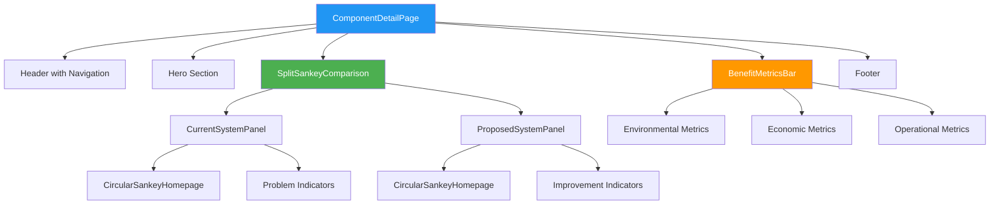
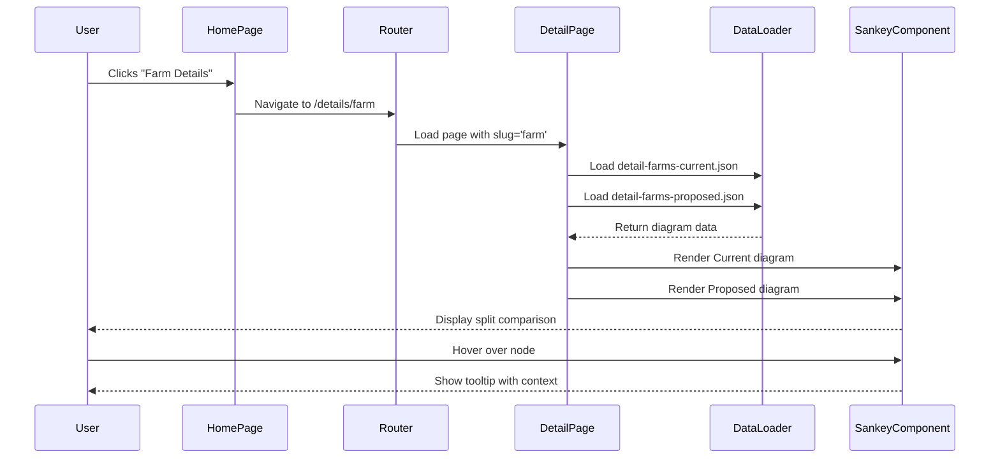
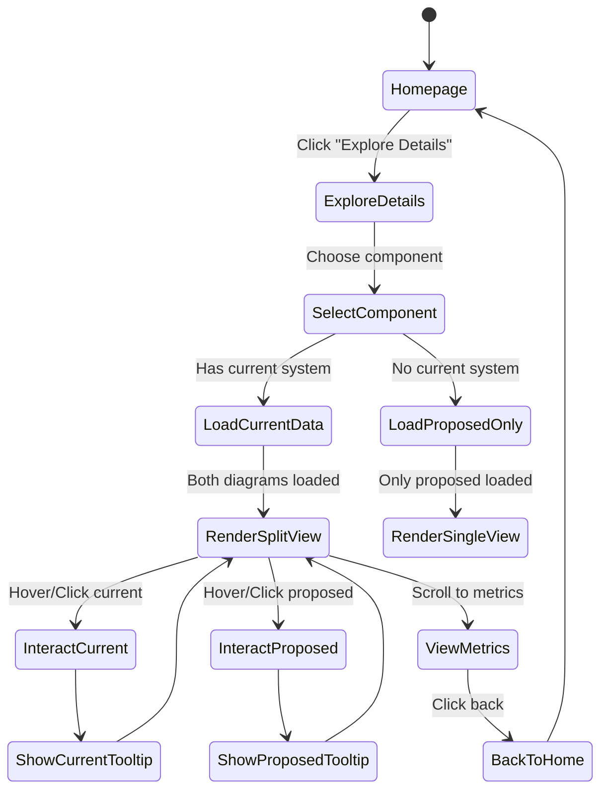
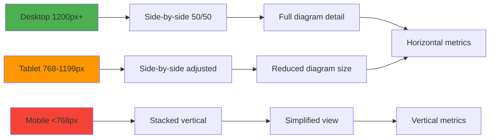
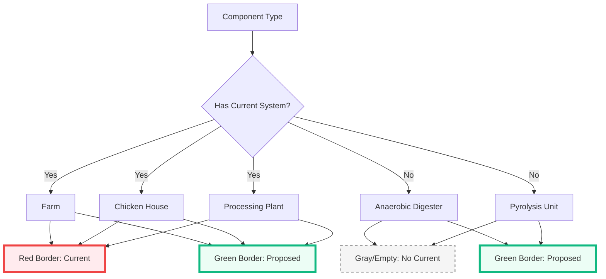
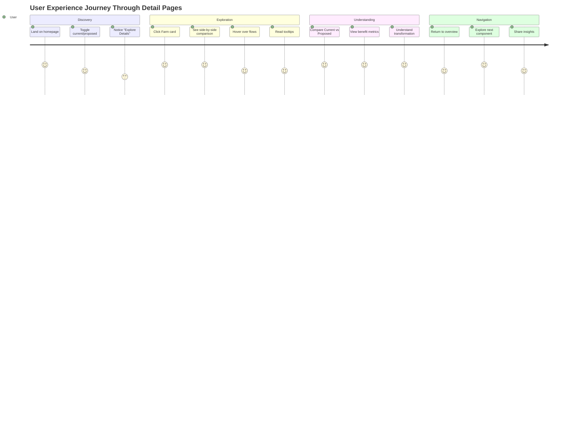

# Component Detail Pages - Visual Architecture Diagram

## System Flow Diagram

```mermaid
graph TB
    subgraph Homepage
        A[Homepage with Toggle] --> B[Current System View]
        A --> C[Proposed System View]
    end
    
    subgraph Navigation
        B --> D[Explore Details Section]
        C --> D
        D --> E[Farm Card]
        D --> F[Chicken House Card]
        D --> G[Processing Plant Card]
        D --> H[Anaerobic Digester Card]
        D --> I[Pyrolysis Unit Card]
    end
    
    subgraph DetailPages[Detail Pages]
        E --> J[/details/farm]
        F --> K[/details/chicken-house]
        G --> L[/details/processing-plant]
        H --> M[/details/anaerobic-digester]
        I --> N[/details/pyrolysis-unit]
    end
    
    subgraph ComponentStructure[Detail Page Structure]
        J --> O[SplitSankeyComparison]
        O --> P[Current Diagram]
        O --> Q[Proposed Diagram]
        O --> R[BenefitMetricsBar]
        P --> S[CircularSankeyHomepage]
        Q --> S
    end
    
    style A fill:#e3f2fd
    style D fill:#fff9c4
    style O fill:#c8e6c9
    style S fill:#ffccbc
```

## Component Hierarchy



## Data Flow



## Page Layout Structure

```
┌──────────────────────────────────────────────────────────────────┐
│  HEADER BAR                                                       │
│  [WasteHub Logo] | [Component Name] | [Back to Overview]         │
├──────────────────────────────────────────────────────────────────┤
│                                                                   │
│  HERO SECTION                                                     │
│  ┌─────────┐                                                      │
│  │  Icon   │  Component Name                                      │
│  │  [SVG]  │  Brief description                                   │
│  └─────────┘                                                      │
│                                                                   │
├──────────────────────────────────────────────────────────────────┤
│                                                                   │
│  SPLIT SANKEY COMPARISON                                          │
│  ┌───────────────────────────┬───────────────────────────────┐  │
│  │  CURRENT SYSTEM          │  PROPOSED SYSTEM              │  │
│  │  ┌──────────────────────┐│  ┌──────────────────────────┐ │  │
│  │  │                      ││  │                      │     │  │
│  │  │  Sankey Diagram      ││  │  Sankey Diagram          │  │
│  │  │  with animated flows ││  │  with animated flows     │  │
│  │  │                      ││  │                          │  │
│  │  └──────────────────────┘│  └──────────────────────────┘ │  │
│  │  [Problems/Challenges]   │  [Benefits/Improvements]      │  │
│  └───────────────────────────┴───────────────────────────────┘  │
│                                                                   │
├──────────────────────────────────────────────────────────────────┤
│                                                                   │
│  BENEFIT METRICS BAR                                              │
│  ┌──────────────┬──────────────┬──────────────┬──────────────┐  │
│  │ 🌍 Environ-  │ 💰 Economic  │ ⚙️ Operation │ 📊 Overall  │  │
│  │    mental    │              │     al       │   Impact    │  │
│  │  -95% runoff │ $50k savings │ +40% quality │  Highly     │  │
│  └──────────────┴──────────────┴──────────────┴──────────────┘  │
│                                                                   │
├──────────────────────────────────────────────────────────────────┤
│  FOOTER                                                           │
│  © 2025 WasteHub | Circular Economy Solutions                    │
└──────────────────────────────────────────────────────────────────┘
```

## Component Interaction Flow



## File Organization

```
poultry-biochar-tool/
├── src/app/
│   ├── page.tsx                          # Homepage
│   └── details/
│       ├── [component]/
│       │   └── page.tsx                  # Dynamic detail page
│       └── layout.tsx                    # Shared layout
│
├── components/
│   ├── comparison/
│   │   ├── SplitSankeyComparison.tsx    # Main split view component
│   │   ├── BenefitMetricsBar.tsx        # Metrics display
│   │   ├── NonExistentCurrentView.tsx   # Empty state
│   │   └── ComparisonHeader.tsx         # Header with labels
│   │
│   ├── d3/
│   │   └── CircularSankeyHomepage.tsx   # Reused Sankey renderer
│   │
│   └── ui/
│       ├── Icon.tsx                      # Icon renderer
│       └── IconTooltip.tsx              # Tooltip component
│
├── data/
│   ├── diagrams/
│   │   ├── detail-farms-current.json
│   │   ├── detail-farms-proposed.json
│   │   ├── detail-chicken-house-current.json
│   │   ├── detail-chicken-house-proposed.json
│   │   ├── detail-processing-plant-current.json
│   │   ├── detail-processing-plant-proposed.json
│   │   ├── detail-anaerobic-digester-proposed.json
│   │   └── detail-pyrolysis-unit-proposed.json
│   │
│   └── benefits/
│       └── component-metrics.json        # New: benefit metrics data
│
└── COMPONENT_DETAIL_PAGES_ARCHITECTURE.md
```

## Responsive Behavior



## Color-Coding Strategy



## User Journey Map



---

**Legend:**
- 🟦 Blue: Navigation/Routing
- 🟩 Green: Core Components
- 🟧 Orange: Data/Metrics
- 🟥 Red: Visualization/Sankey
